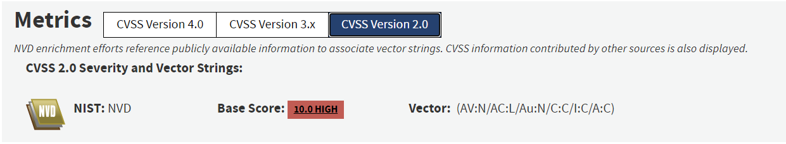

# Exploit di CVE-2010-4221 di ProFTPD versione 1.3.3c

## Introduzione  

Per trovare questa vulnerabilità è stato utilizzato Gemini come motore di ricerca per trovare una vulnerabilità reale di memory corruption del passato. Dopo l'analisi di alcune vulnerabilità è stata scelta questa CVE per poter dimostrare come un Bug, che può fornire informazioni in un modo non previsto, unito alla possibilità di sovrascrittura in memoria, possa causare un danno notevole.  

L'obiettivo di questa prova è creare un exploit che possa aprire una reverse shell sfruttando una CVE nota descritta dal [NIST](https://nvd.nist.gov/vuln/detail/cve-2010-4221) nel segunete modo:

- Multiple stack-based buffer overflows in the pr_netio_telnet_gets function in netio.c in ProFTPD before 1.3.3c allow remote attackers to execute **arbitrary code** via vectors involving a TELNET IAC escape character to a (1) FTP or (2) FTPS server.

Il CVSS v2 di questa vulnerabilità è 10.0 High, come mostrato in immagine, perchè ha un impatto molto grave (Remote Code Execution) e ha Access Vector da Rete,  Access Complexity Bassa e No autenticazione.  

  

## Setup (frutto di varie ricerche su Google)

La CVE analizzata colpisce l'applicazione ProFTPD 1.3.3c per come è creata a livello di codice sorgente, rendendola indipendente da una specifica distribuzione Linux (come tracciato dal NIST tramite lo standard CPE). Tuttavia, ai fini della prova, è stata adottata la distribuzione Ubuntu 12.04 LTS 32bit in quanto piattaforma storicamente coerente con il periodo di rilascio del software (2010-2012), garantendo la compatibilità delle librerie di sistema (glibc) necessarie alla corretta compilazione del binario sorgente.

L'ambiente creato per la prova consiste in 2 macchine virtuali su VirtualBOX:

- Kali Linux 2025.4 per l'attaccante
- Ubuntu Server 12.04 32bit creata a partire dalla iso _ubuntu-12.04-server-i386_ ottenibile nel sito di [Ubuntu Old Release](https://old-releases.ubuntu.com/releases/12.04/)  

**Note tecniche su Ubuntu 12.04 per replicare l'esperimento**  

Per poter rendere questa macchina virtuale operativa al giorno d'oggi, è necessario superare un principale ostacolo tecnico legato allo stato di obsolescenza della distribuzione, ovvero il puntamento ai repository ufficiali ormai dismessi.  
Essendo Ubuntu 12.04 una distribuzione che ha raggiunto lo stato di End of Life (EOL), rif. [Wiki Ubuntu](https://wiki.ubuntu.com/PrecisePangolin/ReleaseNotes), i server di aggiornamento standard non risultano più raggiungibili. In conformità con le linee guida ufficiali di Canonical (società che gestisce le distribuzioni di Ubuntu) sulla gestione delle vecchie release, è necessario reindirizzare il gestore dei pacchetti APT verso i server di archivio storici.

Per fare ciò, il file di configurazione delle sorgenti software (`/etc/apt/sources.list`) deve essere modificato sostituendo i puntamenti obsoleti a `archive.ubuntu.com` e `security.ubuntu.com` con l'URL ufficiale di conservazione:

- [http://old-releases.ubuntu.com/ubuntu/](http://old-releases.ubuntu.com/ubuntu/)

Questa procedura permette al comando `apt-get` di interrogare correttamente l'albero dei pacchetti del 2012 e scaricare le dipendenze software necessarie alla configurazione della macchina.  
